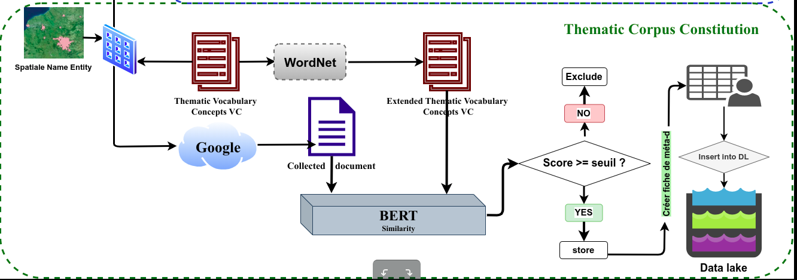

# Protocole de collecte de données textuelles pour la constitution de corpus thématiques

Les différentes étapes du protocoles sont entre autres:



## 3. La constitution des corpus thématiques

* un  vocabulaire de concepts est utilisé pour collecter des documents sur Google et former ainsi de gros corpus thématiques.

* Pour s'assurer de la qualité des contenus des documents que nous collectons, nous avons mis en place une évaluation automatisée, basée sur la mesure de similarité proposée précédement avec DistilBert. Cette mesure de similarité est faite pour chaque  document collecté, avec le vocabulaire de concepts étendus. Pourquoi un vocabulaire de concepts étendus ? Nous proposons d'utiliser un vocabulaire de concepts étendus pour chaque thématique lors de la collecte, dans le but de pouvoir prendre en compte les documents de nature sociétale, dont le contenu contient un language moins soutenu (orienté société ou language de la majorité), généralement en provenance des forums blogs etc. Le vocabulaire de concepts étendus est obtenu en génerant pour chaque terme du vocabulaire initial, des synonymes en utilisant WordNet.

* Les documents obetenus, avec leur score de similarité sont ainsi classés par ordre décroissant, les scores les plus élevés correspondent aux documents les plus pertinents vis-à-vis de leur contenu. 

```
# _Confère fichier example.ipynb pour application
```

### NB: Les corpus thématiques peuvent être obtenus en exécutant directement l'épate "3 - Final step to build thematic corpora" du fichier container.ipynb car les vocabulaires de concepts sont déjà élaborés dans le repertoir ./voc_concepts
